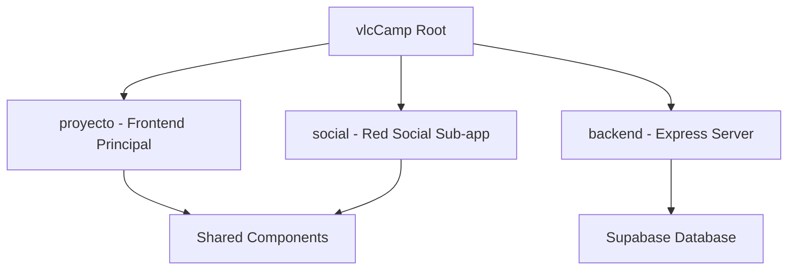

# 🏕️ VLC Camp - Plataforma de Gestión de Campamentos

VLC Camp es una solución integral para la gestión, coordinación y reserva de campamentos en la Comunidad Valenciana. La plataforma conecta a familias, colegios y gestores de campamentos a través de una interfaz intuitiva y potentes herramientas de administración.

---

## 🏗️ Arquitectura del Proyecto

El proyecto está diseñado como una aplicación multi-servicio orquestada con **Docker Compose**, compuesta por:

1.  **Frontend Principal**: Aplicación React + Vite para el catálogo público y gestión de reservas.
2.  **Social App**: Una sub-aplicación dedicada a la interacción estilo red social para monitores y padres.
3.  **Backend API**: Servidor Express.js que maneja la lógica de negocio, envíos de email y persistencia.
4.  **Base de Datos**: Integración con **Supabase** (PostgreSQL) para perfiles, campamentos, reseñas y tablas auxiliares.

---

## 🚀 Características Principales

-   **Catálogo Público**: Visualización de campamentos con detalles, ubicación y disponibilidad.
-   **Sistema de Reservas**: Flujo de reserva online con confirmación automática vía email.
-   **Gestión para Propietarios**: Panel para que los gestores de campamentos actualicen información y vean estadísticas.
-   **Red Social VLC**: Espacio para que monitores compartan actividades y los padres sigan el día a día.
-   **🤖 Chatbot "Eugenio"**: Asistente inteligente basado en **Groq AI** para resolver dudas frecuentes.
-   **Seguridad**: Autenticación basada únicamente en **Email/Password** y perfiles vinculados en Supabase.

---

## 🛠️ Stack Tecnológico

-   **Frontend**: React, Vite, Tailwind CSS (en componentes específicos), Context API.
-   **Backend**: Node.js, Express.js.
-   **IA**: Groq SDK (Llama 3 / Mixtral) para el chatbot.
-   **Base de Datos**: Supabase (PostreSQL + RLS).
-   **Comunicaciones**: Integración con Brevo para el envío de correos transaccionales.
-   **Despliegue**: Docker, Docker Compose, Nginx.

---

## 📦 Instalación y Despliegue

La forma más sencilla de ejecutar VLC Camp es utilizando Docker:

### Requisitos Previos
- Docker y Docker Desktop
- Un archivo `.env` configurado en la raíz del proyecto.

### Pasos para el despliegue
1. Clona el repositorio.
2. Configura las variables de entorno (ver sección abajo).
3. Ejecuta el comando:
   ```bash
   docker compose up --build -d
   ```
4. Accede a las aplicaciones:
   - **Frontend**: http://localhost:3000
   - **Social App**: http://localhost:3001
   - **Backend API**: http://localhost:4000

---

## 🔑 Variables de Entorno

Asegúrate de tener un archivo `.env` con las siguientes claves:

```env
# Supabase
VITE_SUPABASE_URL=tu_url_supabase
VITE_SUPABASE_ANON_KEY=tu_anon_key
SUPABASE_SERVICE_ROLE_KEY=tu_service_role_key

# Inteligencia Artificial
VITE_GROQ_API_KEY=tu_groq_api_key

# Backend y otros
CORS_ORIGIN=http://localhost:3000
BREVO_API_KEY=tu_brevo_api_key
```

---

## 📐 Estructura del repositorio



---

## 🎨 Prototipos y Diseño

### Propuesta Original


### Mapa de Navegación


### 🖥️ Frames — Versión Escritorio
````carousel

<!-- slide -->

<!-- slide -->

<!-- slide -->

<!-- slide -->

<!-- slide -->

<!-- slide -->

<!-- slide -->

<!-- slide -->

<!-- slide -->

<!-- slide -->

````

### 📱 Frames — Versión Móvil
````carousel

<!-- slide -->

<!-- slide -->

<!-- slide -->

<!-- slide -->

<!-- slide -->

<!-- slide -->

````

---

### Enlaces a Figma
- **Escritorio**: [Ver prototipo](https://www.figma.com/proto/XMqgzuWBg2S19xbsDGbOCy/Proyecto?page-id=0%3A1&node-id=1912&viewport=414%2C240%2C0.32&t=RbwfNc04QjxXuMfg-1&scaling=scale-down&content-scaling=fixed&starting-point-node-id=19%3A12)
- **Móvil**: [Ver prototipo](https://www.figma.com/proto/XMqgzuWBg2S19xbsDGbOCy/Proyecto?node-id=221-1588&t=quyk3KLtDdKv9P6h-1)

---

Developed with ❤️ by the VLC Camp Team.
